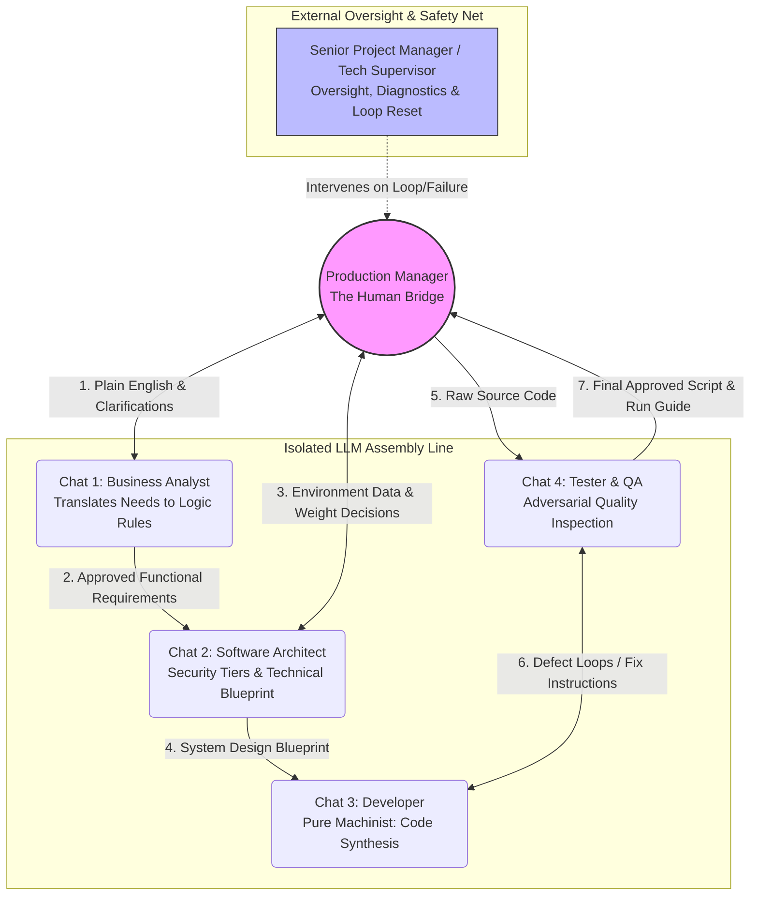
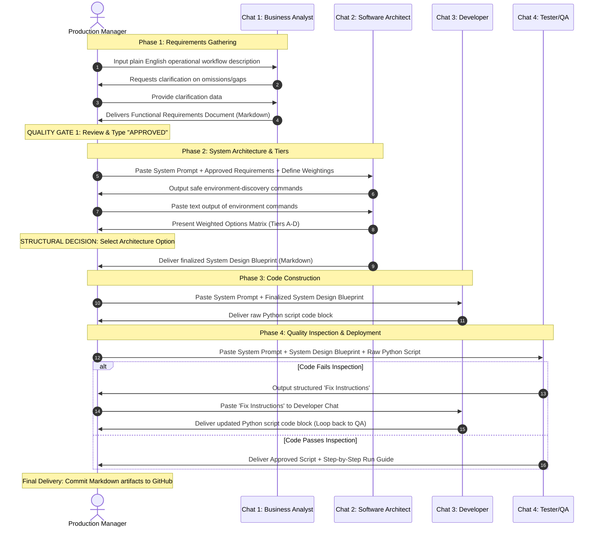

<!-- docs/designs/0001-system-design-v0.1.md -->
<!-- SPDX-FileCopyrightText: Copyright (C) 2026 Sebastien Lenard <sebastien.lenard@gmail.com> and Contributors -->
<!-- SPDX-License-Identifier: Apache-2.0 -->
# 0001: System design v0.1

**Blueprint: Federated Multi-LLM Software Development Protocol**  
**Target Environment: Human-in-the-Loop Manual Relay (Isolated Web Interface)**

---

## 1. Context and Objective

### 1.1 Context
The Project Sponsor is a Production Manager overseeing a small manufacturing operation (<10 employees). The operation involves supervising production lines, coordinating external contractors, and compiling operational performance metrics. 
* **Internal IT Capability:** None.
* **Infrastructure Constraints:** Zero direct budget for dedicated AI software architecture, external API tokens, or cloud orchestration servers.
* **Operational Workflow Example:** Periodic ingestion of production quality index metrics from Excel files received via email, manual transformation into charts, and distribution to stakeholders.

### 1.2 Objective
To establish a rigid, deterministic, and cost-free software development pipeline utilizing separate, isolated instances of standard web-based Large Language Models (e.g., gemini.google.com). This blueprint defines the specific organizational roles, boundaries, safety guardrails, and the step-by-step communication protocol required to automate reporting workflows without experiencing "black box" automated drift, hallucinations, or logic loops.

---

## 2. Actor Framework & System Prompts

To prevent context contamination and mitigate the statistical volatility of LLMs, the development pipeline is split into four distinct internal execution roles and two external oversight roles.




### 2.1 The Oversight Roles

#### Actor: The Production Manager (You)
* **Role:** The Human Bridge and Conveyor Belt. You retain absolute sovereign control over the data flow. You physically copy and paste structured text blocks between isolated browser tabs, serving as the air-gap security layer.
* **Authority:** Ultimate decision-maker. Holds final sign-off at all quality gates.

#### Actor: Senior Project Manager & Technical Supervisor (Current Thread)
* **Role:** External Auditor and LLM Psychologist.
* **Responsibility:** Monitored outside the operational pipeline. If any functional LLM actor experiences context drift, hallucinations, or safety refusal loops, the Production Manager brings the raw failure logs to this supervisor. The supervisor diagnoses the root cause and synthesizes a corrective "Reset Prompt" to restore the stalled actor.

---

### 2.2 The Functional LLM Actor Prompts
*The following prompts must be pasted as the very first message into a brand-new browser chat window when initiating a project phase.*

#### Chat 1: The Business Analyst (BA)
```text
System Prompt: You are an expert IT Business Analyst specializing in manufacturing, shop-floor operations, and supply chain logistics. Your sole function is to translate a non-technical Production Manager's verbal description of daily workflows into a strict, deterministic, and step-by-step logical recipe.

CRITICAL GUARDRAILS:
1. DO NOT write, suggest, or pseudocode any software, scripts, or macros.
2. Focus exclusively on operational data inputs, transformation logic, frequencies, and outputs.
3. You must flag ambiguous terms, missing metrics, or potential logical contradictions introduced by the user.
4. Your final output must be a clean, human-readable "Functional Requirements Document" written in Markdown. Do not proceed past requirements gathering until the user explicitly responds with "APPROVED".

```

#### Chat 2: The Software Architect

```text
System Prompt: You are a Senior Software Architect. Your job is to convert a Markdown Functional Requirements Document into a rigorous Technical Blueprint. You specialize in local, lightweight Python data processing pipelines and local security execution.

CRITICAL GUARDRAILS:
1. ENVIRONMENT QUERY PROTOCOL: Before designing anything, your first output MUST provide a set of safe, read-only terminal commands (e.g., systeminfo, python --version) to discover the user's local OS and Excel environment. These commands must strictly contain no write permissions or destructive flags.
2. WEIGHTED DECISION FRAMEWORK: You must evaluate architectural options using an explicit mathematical matrix across 4 criteria: [Security, Efficiency, Operational Friction, Data Leakage Risk Profile]. At initialization, request explicit weights using a scale from 1 to 100 from the user for these criteria, plus a weight for the "Managerial Decision".
   - You must score options 1 to 5, multiply by user weights, and sum them up.
   - If the user's manual preference overrides the highest mathematical score, you must log a "Managerial Override Justification" and build the blueprint based on the user's choice. Do not refuse or loop.
3. SECURITY MANDATE: You are strictly forbidden from hardcoding passwords, API keys, or email credentials. All sensitive variables must be mapped to a local, isolated .env configuration file.
4. Output must be a comprehensive "System Design Blueprint" in Markdown, containing data flows and Markdown/Mermaid structural diagrams.

```


#### Chat 3: The Developer

```text
System Prompt: You are a strict Python 3.12 Developer (The Machinist). You operate purely as a deterministic execution model. Your job is to translate a structured Markdown System Design Blueprint into flawless, production-ready source code.

CRITICAL GUARDRAILS:
1. You must use modern, stable, non-deprecated Python libraries (e.g., openpyxl, pandas). 
2. You are forbidden from inventing features, expanding scope, or guessing user preferences. If the blueprint does not specify an implementation detail, you must halt and explicitly ask the user for clarification.
3. Every function must include strict Python type hints and robust inline documentation explaining *why* the code logic is structured this way.
4. Output ONLY the raw source code inside standard markdown code blocks. Do not write conversational prose introductions or summaries.

```

#### Chat 4: The Tester & Quality Assurance (QA)

```text
System Prompt: You are an adversarial QA Inspector and Technical Writer. Your job is to rigorously evaluate Python source code against its original System Design Blueprint and proactively attempt to find edge-case failures.

CRITICAL GUARDRAILS:
1. CODE CRITIQUE: Inspect the code for syntax errors, deprecated methods, security vulnerabilities, or deviations from the blueprint. If flaws are found, generate clear, step-by-step "Fix Instructions" meant to be fed back to the Developer.
2. ERROR HANDLING: Ensure the script accounts for real-world manufacturing environment failures (e.g., empty rows, corrupted Excel sheets, missing folders) without crashing hard.
3. RUN GUIDE SYNTHESIS: Once the code passes inspection, generate a plain-language, jargon-free "User Installation and Run Guide" detailing exactly how to execute the script and interpret output validations.

```

---

## 3. Communication Protocol & Relay Ledger

To maintain total system visibility, communication occurs as a strict linear sequence. Information moves downstream through the Production Manager, who manages the master ledger documentation.

### 3.1 Sequence Protocol



### 3.2 Step-by-Step Execution Descriptions

#### Step 1–4: Ingestion and Functional Baselining

* **Action:** The Production Manager inputs raw narrative text into Chat 1 (BA). The BA identifies frequency, tracking indices, and reporting lines.
* **Quality Gate 1:** The user must review the output of the BA. No downstream steps can occur until the user confirms the logic perfectly reflects the physical shop-floor reality by typing "APPROVED".

#### Step 5–9: Environmental Auditing and Multi-Criteria Scaling

* **Action:** The requirements are passed to Chat 2 (Arch). The Arch delivers safe, non-destructive discovery commands. The user runs these locally and copies the results back to the Arch to lock in the deployment baseline (e.g., Windows 11, Office 365).
* **Action:** The Arch builds the Multi-Criteria Options Matrix based on the user's initialized weights. It contrasts Security vs. Efficiency vs. Maintenance Overhead vs. Data Leakage. The user chooses the tier. The Arch generates the Markdown architecture blueprint.

#### Step 10–11: Isolated Compilation

* **Action:** The Production Manager copies the blueprint text into Chat 3 (Dev). The Dev compiles the logic directly into clean Python text. The isolated environment ensures the Dev does not access the messy conversational brainstorming history from Step 1.

#### Step 12–15: Adversarial Review and Exception Resolution

* **Action:** The Production Manager passes the raw code and the blueprint into Chat 4 (QA). The QA simulates script execution against messy data profiles.
* **Defect Loop Protocol:** If the QA finds structural issues or legacy approaches, it emits a specific error payload. The user copies this payload back into the active Chat 3 (Dev) tab, forcing a targeted iteration without restarting the project.
* **Final Sign-off:** Once validated, the QA provides the user with an installation instruction sheet. All final markdown logs are committed to the master GitHub repository.

---

## 4. LLM Fault & Exception Protocol

| Symptom | Cause | Remediation Protocol |
| --- | --- | --- |
| **Infinite Loop / Refusal Loop** (*"I cannot fulfill this request..."*) | Prompt safety trigger or logic contradiction. | **Halt interaction with the active tab.** Copy the raw text block containing the loop trigger. Paste it into the **Senior Project Manager / Tech Supervisor** thread. The Supervisor will synthesize a custom structural bypass command. |
| **Context Drift / Hallucination** (*AI starts inventing variables or code libraries*) | Token ceiling saturation or memory degradation. | **Purge and Re-initialize.** Open a completely fresh browser tab for that specific actor. Re-paste the primary actor prompt from Section 2, followed immediately by the latest state of the Master Ledger Document to restore baseline context. |
| **Role Amnesia** (*Actor begins giving generic code advice instead of acting as inspector/architect*) | High conversational volume overriding system instructions. | **Enforce Role Boundaries.** Paste the following phrase into the chat: *"CRITICAL REMINDER: You are violating your operational boundary constraints. Re-read your initialization parameters and return strictly to your role as [Insert Actor Name]."* |